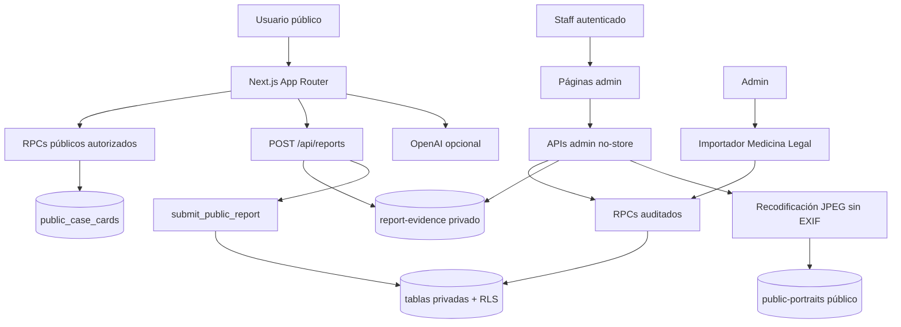

# Contexto completo del proyecto Encontrarnos

**Actualizado:** 13 de agosto de 2026

**Línea base auditada antes de esta actualización:** `cd0cb7c41b13bd10ad5df67354727e278dfe6035`

**Estado verificado el 13 de agosto de 2026:** migración `202608130003` aplicada en producción; importación oficial auditada de 142 filas completada; snapshot, RLS, buckets, pruebas SQL, lint, typecheck, 146 pruebas unitarias, build y 7 E2E aprobados. El hash del código desplegado se contrasta por separado en la entrega.

Este documento describe lo que existe en el repositorio. No afirma que la migración más reciente, los buckets, las variables ni el commit candidato estén presentes en producción sin una comprobación independiente.

## Resumen ejecutivo

Encontrarnos es una plataforma humanitaria, mobile-first y privada por defecto para buscar personas y recibir información comunitaria después de un desastre. Permite:

- buscar casos revisados y publicados;
- consultar por separado fallecidos confirmados por autoridad;
- reportar una persona desaparecida;
- enviar avistamientos, posibles situaciones urgentes, correcciones u otra información;
- revisar y publicar casos nuevos desde un panel autenticado;
- moderar avistamientos sin cambiar el estado del caso;
- gestionar contactos mediante intermediación privada;
- importar fallecidos confirmados desde Medicina Legal con preview, confirmación y auditoría.

No sustituye a las autoridades, servicios de emergencia, Medicina Legal ni mecanismos oficiales de reunificación familiar.

### Estado funcional

Implementado en código:

- App Router, TypeScript estricto y diseño responsive.
- Búsqueda pública mediante RPCs y allowlist defensiva.
- Home con entradas separadas a desaparecidos y fallecidos.
- `/fallecidos` con filtro efectivo `published` + `deceased_confirmed` + `authority_confirmed`, búsqueda y paginación desde Supabase.
- `/buscar` con filtros públicos visibles limitados a todos, desaparecidos y fallecidos confirmados.
- Reporte público simplificado en tres pasos y recibo sin código, URL ni control de copia visibles; el tracking permanece interno.
- Evidencia original en bucket privado.
- `/admin/personas-pendientes` para publicar, rechazar, deduplicar, archivar o pedir información.
- Promoción de retratos a JPEG público sanitizado y sin EXIF.
- Cola de reportes y publicación exclusiva de sightings aprobados.
- `/admin/seguimiento-contactos` con historial append-only.
- Importador web CSV de Medicina Legal, solo `admin`, y CLI controlado para las 142 filas 1–142 de las capturas.
- Diagnóstico temporal protegido de esquema, RLS, migraciones, buckets y conteos públicos agregados.
- Pruebas unitarias, de componentes, APIs, flujos SQL y E2E.

No implementado o incompleto:

- La confirmación pública genérica no recibe un código ni consulta la existencia o estado del reporte; una ruta heredada que lo contiene solo valida su formato y redirige para retirarlo de la barra de direcciones.
- No hay interfaz general para transiciones a localizada, reunida o cerrada, ni un flujo completo de rectificación de una importación oficial.
- No hay mensajería automática por WhatsApp, SMS o correo.
- No hay política organizacional completa de retención, derechos del titular, respuesta a incidentes o aprobación independiente de cuatro ojos.
- La ayuda con IA y Turnstile dependen de configuración externa.

## Principios de seguridad

1. Privado por defecto: un dato no es público por estar almacenado.
2. Ninguna acción pública cambia estado, verificación o publicación de un caso.
3. Aprobar un avistamiento publica solo texto y ubicación aproximados revisados.
4. `deceased_confirmed` es exclusivamente administrativo y requiere autoridad, razón, referencia privada, historial y auditoría.
5. Contactos, ubicaciones exactas, evidencia, rutas de Storage, notas y referencias de autoridad nunca forman parte del contrato público.
6. El equipo actúa como intermediario; no se publica contacto directo.
7. La evidencia privada no se convierte en retrato público por reutilizar una URL: se descarga, valida, transforma y copia a otro bucket.
8. Los menores reciben tratamiento conservador y no justifican exponer campos privados.
9. No hay reconocimiento facial ni generación de fotos de personas.
10. Los datos ficticios se crean solo con opt-in explícito en desarrollo/demo.

Los reportes `possible_trapped` y `possible_deceased` son sensibles y pendientes. Una afirmación comunitaria sobre posible fallecimiento nunca confirma la condición de la persona.

## Arquitectura

### Tecnología

- Next.js 15, React 19, App Router y TypeScript estricto.
- Supabase Auth, PostgreSQL, RLS, RPCs y Storage.
- Zod para validación de entradas.
- Sharp para sanitizar retratos antes de publicación.
- OpenAI Responses API opcional para interpretar búsquedas.
- Cloudflare Turnstile opcional cuando sus tres variables están completas.
- Vitest, Testing Library y Playwright.

No existe Pages Router ni `pages/api`; las páginas y route handlers viven bajo `src/app`.

### Límites de confianza



La clave publicable se usa para Auth y lecturas autorizadas. La service role permanece en servidor y se reserva para recepción pública, Storage y diagnóstico protegido.

## Flujo público

### Buscar

`/`, `/buscar`, `/fallecidos` y `/persona/[slug]` llaman a `search_public_people` o `get_public_case`. Esos RPCs leen `public_case_cards`; después `sanitizePublicCase` conserva solo el contrato permitido.

Las cards pueden mostrar:

- nombre y edad aproximada;
- estado, verificación y fuente pública;
- fecha y lugar aproximados;
- `reported_unit` seguro, etiquetado como `Unidad básica / lugar reportado` para fallecidos oficiales;
- descripción pública;
- retrato aprobado o placeholder;
- conteo y detalle de sightings aprobados.

La vista fuerza `distinguishing_features` y `clothing` a `null`. Nunca expone contacto, ubicación privada, evidencia, `authority_reference_private`, `source_reference`, razón administrativa, operador, auditoría o reportes pendientes. `public_source_label` es la única atribución de fuente proyectada a las cards.

En `/buscar`, la UI ofrece solo `Todos`, `Desaparecidos` y `Fallecidos confirmados`. Los estados internos restantes siguen existiendo, pero no se ofrecen como filtros en esta fase. `/fallecidos` vuelve a filtrar defensivamente `deceased_confirmed` + `authority_confirmed`; `public_case_cards` ya garantiza `published`, no eliminado y no demo.

### Reportar una persona desaparecida

`/reportar-desaparecido` es un formulario de tres pasos:

1. Nombre, edad opcional, foto opcional y descripción de identificación opcional.
2. Fecha, hora opcional y lugar aproximado de última vez vista.
3. Nombre y teléfono privados, consentimiento y CAPTCHA cuando está habilitado.

La foto admite JPG/PNG/WebP y máximo 8 MB. `POST /api/reports` valida tamaño, MIME, honeypot, consentimiento, rate limit y CAPTCHA; sube el original a `report-evidence` y llama `submit_public_report`. Si falla la transacción, intenta limpiar el objeto huérfano.

El resultado es:

- persona privada;
- caso `pending_review`, condición `missing`, sin publicación;
- reporte inicial `pending` y sensible;
- contacto privado;
- código de seguimiento.

### Enviar información

`/persona/[slug]/informacion` acepta:

- `sighting` con contexto `sighting_alive`;
- `sighting` con contexto `sighting_care`;
- `possible_trapped`;
- `possible_deceased`;
- `correction`;
- `other_information`.

Los sightings requieren ubicación. Hospital/refugio, atrapamiento y posible fallecimiento requieren teléfono. Descripción, ubicación original, contacto y evidencia permanecen privados. Solo un sighting aprobado por staff puede proyectar una descripción y ubicación redactadas.

### Recibo

`POST /api/reports` devuelve al navegador únicamente `{ "received": true }`; no entrega el tracking. Ambos formularios navegan a `/reporte/confirmacion`, cuyo HTML no muestra un código, una URL, `localhost` ni un botón de copia. Solo confirma la recepción y ofrece volver al inicio o reportar otra persona. La página declara `noindex, nofollow`, no consulta la base de datos y no es una prueba de estado ni una pantalla para confirmar a una persona.

Por compatibilidad, `/reporte/confirmacion/[trackingCode]` valida el formato y redirige inmediatamente a `/reporte/confirmacion`, retirando el código también de la barra de direcciones. El tracking permanece únicamente en Supabase y las herramientas administrativas autorizadas.

## Flujos administrativos

### Personas pendientes

`/admin/personas-pendientes` requiere `moderator` o `admin`.

1. `get_pending_people_cases` entrega caso, contacto y metadatos de evidencia; el acceso se audita.
2. El moderador consulta la evidencia mediante el proxy privado auditado.
3. Los campos de publicación empiezan vacíos; se redactan de nuevo y rechazan teléfonos/correos.
4. `publish` exige lugar público aproximado y razón.
5. Una foto opcional se transforma a JPEG de hasta 1600 × 1600, sin EXIF, y se sube a `public-portraits`.
6. `review_pending_person_case` publica como `missing` + `moderator_reviewed`, o aplica `reject`, `duplicate`, `request_information` o `archive`.
7. La acción y auditoría quedan registradas. Un error posterior a la subida activa limpieza del retrato.

Esta ruta no puede confirmar fallecimientos.

### Avistamientos y otros reportes

`/admin/avistamientos` es la ruta canónica; `/admin/posibles-avistamientos` redirige allí. Todos los roles de staff pueden leer la cola. Solo `moderator` y `admin` ven y ejecutan acciones.

`moderate_case_report` acepta reportes `pending` o `escalated`. Solo `sighting` puede aprobarse y publicar campos revisados. También existen rechazo, duplicado, escalamiento y solicitud de información. Ninguna acción cambia la condición del caso.

### Seguimiento de contactos

`/admin/seguimiento-contactos` muestra casos/reportes con contacto y su historial. `admin` y `moderator` registran gestiones; `responder` tiene solo lectura.

`contact_followups` guarda objetivo, método, estado, resumen privado, próxima fecha, autor y fecha. La tabla no admite escritura directa autenticada; `log_contact_followup` valida relaciones y crea la fila y auditoría en la misma operación. No existe actualización o borrado: una corrección se agrega como una entrada posterior.

### Fallecimientos oficiales

`/admin/importar-fallecidos` y su ayuda requieren `admin`. El importador web conserva el CSV legado de siete columnas, con `source_reference` obligatoria, preview ligado al usuario/CSV, confirmación explícita y justificación.

El CLI `npm run import:official-deceased -- data/imports/medicina-legal-fallecidos-captura-2026-08-13.csv` maneja por separado el archivo controlado de diez columnas y 142 filas 1–142. Exige token de sesión de un admin, razón y `CONFIRM_OFFICIAL_IMPORT=MEDICINA_LEGAL`; ejecuta preview, bloquea revisión manual y usa `source_reference + source_row` como identidad idempotente privada. El detalle está en [importar-fallecidos-medicina-legal.md](importar-fallecidos-medicina-legal.md).

## Rutas y roles

### Páginas

| Ruta | Acceso | Función |
| --- | --- | --- |
| `/` | Público | Inicio y categorías. |
| `/buscar` | Público | Buscar publicados; filtros visibles de todos, desaparecidos y fallecidos confirmados; hasta 48 cards por página. |
| `/buscar/ia` | Público | Ayuda opcional con IA. |
| `/fallecidos` | Público | Solo publicados, fallecidos y confirmados por autoridad; búsqueda y hasta 48 cards por página desde Supabase. |
| `/reportar-desaparecido` | Público | Reporte nuevo. |
| `/reportar` | Público | Redirección al reporte nuevo. |
| `/persona/[slug]` | Público | Ficha pública. |
| `/persona/[slug]/informacion` | Público | Información privada sobre un caso. |
| `/reporte/confirmacion` | Público no indexable | Recibo genérico sin código/URL/copia visibles; tracking interno. |
| `/reporte/confirmacion/[trackingCode]` | Público no indexable | Compatibilidad heredada; valida y redirige a la confirmación genérica. |
| `/privacidad` | Público | Resumen de privacidad. |
| `/correccion` | Público | Orientación para correcciones. |
| `/retiro` | Público | Orientación para retiro. |
| `/admin/login` | Público | Auth de staff. |
| `/admin` | Staff activo | Panel según rol. |
| `/admin/personas-pendientes` | Moderator/admin | Revisión/publicación de casos. |
| `/admin/avistamientos` | Staff; escritura moderator/admin | Cola de reportes. |
| `/admin/posibles-avistamientos` | Igual anterior | Alias. |
| `/admin/seguimiento-contactos` | Staff; escritura moderator/admin | Seguimientos privados. |
| `/admin/importar-fallecidos` | Admin | Importación oficial. |
| `/admin/importar-fallecidos/ayuda` | Admin | Guía del CSV. |

### Route handlers

| Endpoint | Método | Función |
| --- | --- | --- |
| `/api/health` | GET | Configuración, alcance DB, versión de esquema, disponibilidad de fallecidos y validez de `APP_URL`, sin secretos. |
| `/api/search` | GET | Búsqueda pública. |
| `/api/ai-search` | POST | Interpretación y búsqueda pública. |
| `/api/reports` | POST | Recepción pública privada por defecto. |
| `/api/debug/reports` | GET | Diagnóstico temporal con token, incluyendo conteos públicos agregados y estado del filtro de fallecidos. |
| `/api/admin/pending-people` | GET/POST | Cola y revisión de casos. |
| `/api/admin/sightings` | GET/POST | Cola y moderación de reportes. |
| `/api/admin/contact-followups` | GET/POST | Cola y registro de seguimientos. |
| `/api/admin/private-media/[assetId]` | GET | Evidencia privada autorizada/auditada. |
| `/api/admin/import-deceased` | POST | Preview/confirm oficial. |

No existen rutas equivalentes bajo Pages Router. Las respuestas administrativas sensibles usan `Cache-Control: private, no-store, max-age=0`.

## Componentes relevantes

| Componente | Responsabilidad |
| --- | --- |
| `CaseCard` | Card pública sin campos privados. |
| `StatusBadge` / `VerificationBadge` | Etiquetas públicas en español y atribución oficial. |
| `MissingPersonForm` | Reporte simplificado en tres pasos. |
| `InformationForm` | Avistamientos y otros tipos de información. |
| `PendingPeopleQueue` | Revisión y publicación de casos pendientes. |
| `SightingsQueue` | Cola de reportes y acciones según rol. |
| `ContactFollowupsQueue` | Seguimiento privado append-only. |
| `OfficialDeceasedImporter` | Preview y confirmación CSV. |
| `Turnstile` | CAPTCHA opcional. |
| `PhotoPlaceholder` | Fallback cuando no hay retrato aprobado. |

## Base de datos

### Enums

| Enum | Valores |
| --- | --- |
| `publication_status` | `draft`, `pending_review`, `published`, `hidden`, `archived` |
| `condition_status` | `missing`, `possibly_trapped`, `located_alive`, `reunited`, `deceased_confirmed`, `closed` |
| `verification_level` | `unverified`, `moderator_reviewed`, `authority_confirmed` |
| `report_type` | `sighting`, `possible_trapped`, `possible_deceased`, `correction`, `other_information` |
| `moderation_status` | `pending`, `approved`, `rejected`, `duplicate`, `escalated` |
| `urgency_level` | `normal`, `priority`, `urgent`, `critical` |
| `app_role` | `public`, `reporter`, `moderator`, `responder`, `admin` |

### Tablas

| Tabla | Propósito | Exposición pública |
| --- | --- | --- |
| `profiles` | Perfil y rol de Auth. | Nunca. |
| `people` | Identidad y campos privados/públicos. | Solo proyección. |
| `cases` | Estado, publicación, ubicación, `reported_unit` y autoridad privada. | Solo proyección segura. |
| `case_reports` | Reportes y moderación. | Solo sightings aprobados redactados. |
| `reporter_contacts` | Contacto/consentimiento. | Nunca. |
| `media_assets` | Evidencia y retratos. | Solo URL aprobada en vista. |
| `contact_followups` | Historial de mediación. | Nunca. |
| `official_deceased_import_entries` | Bitácora privada e idempotencia por referencia/fila de fuente y huella canónica del payload. | Nunca. |
| `moderation_actions` | Decisiones administrativas. | Nunca. |
| `status_history` | Transiciones de alto impacto. | Nunca. |
| `audit_logs` | Trazabilidad. | Nunca. |
| `submission_rate_limits` | Control antiabuso. | Nunca. |

No existe `case_status_history`; el nombre real es `status_history`. No existe `case_removal_requests`.

### Proyección y RLS

`public_case_cards` incluye exclusivamente casos publicados, no borrados y no demo. Proyecta `reported_unit` solo después de las validaciones de texto público y `public_source_label` como única fuente segura. El acceso directo a la vista está revocado; los RPCs públicos son la frontera estable.

RLS protege tablas privadas. Las migraciones 005 y 006 revocan DML directo y fuerzan RLS en las nuevas bitácoras para impedir que una política amplia se convierta en una vía de mutación. Las escrituras sensibles usan RPCs `security definer` con `search_path` fijado, verificación de rol, límites y auditoría.

## Migraciones

| Orden | Archivo | Aporte principal |
| --- | --- | --- |
| 1 | `202608120001_initial.sql` | Esquema, enums, RLS, vista y datos demo condicionados. |
| 2 | `202608120002_harden_public_report_submission.sql` | RPC de recepción, tracking y rate limit. |
| 3 | `202608120003_fix_report_urgency_and_diagnostics.sql` | Urgencia y diagnóstico seguro. |
| 4 | `202608120004_public_flows_and_official_imports.sql` | Evidencia privada, reportes públicos revisados, moderación e importador inicial. |
| 5 | `202608130001_production_review_and_contact_followups.sql` | Revisión de personas, followups, retratos públicos sanitizados, contrato público endurecido, roles/permisos e importador idempotente. |
| 6 | `202608130002_official_deceased_capture_and_diagnostics.sql` | `reported_unit`, bitácora privada por referencia/fila, RPCs compatibles con ambos importadores y diagnóstico/conteos agregados. |
| 7 | `202608130003_admin_case_withdrawal_and_message_threads.sql` | Retiro lógico auditado, gestión de publicadas, hilos privados por caso y diagnóstico `202608130003`. |

La versión esperada por `reports_debug_snapshot` es `202608130003`. Hay que contrastar `lastMigrationApplied`, `schemaVersion`, `publishedCounts`, `deceasedFilterReady`, tablas, RLS, RPCs y buckets en cada liberación.

## RPCs vigentes

### Públicos

- `search_public_people`
- `get_public_case`
- `submit_public_report` —ejecutable por service role desde `/api/reports`, no directamente por `anon`—

### Staff

- `get_pending_people_cases`
- `review_pending_person_case`
- `get_pending_case_reports`
- `moderate_case_report`
- `get_contact_followup_queue`
- `log_contact_followup`
- `get_staff_media_asset`
- `get_admin_people_cases`
- `withdraw_person_case`
- `get_admin_case_message_threads`
- `preview_official_deceased_import`
- `import_official_deceased`

### Diagnóstico

- `reports_debug_snapshot` —solo service role—

## Storage y fotos

| Bucket | Visibilidad | Uso |
| --- | --- | --- |
| `report-evidence` | Privado | Foto inicial y evidencia JPG/PNG/WebP, hasta 8 MB. |
| `public-portraits` | Público | Retratos aprobados y recodificados como JPEG. |

La migración 004 asegura el bucket privado. La 005 asegura `public-portraits`. Una foto se vuelve pública solo durante `publish` en la revisión de persona:

1. autorización y auditoría de la evidencia;
2. descarga con service role;
3. validación de MIME, tamaño y píxeles;
4. auto-rotación y resize máximo 1600 × 1600;
5. salida JPEG progresiva sin metadatos originales;
6. subida `portraits/{caseId}/{uuid}.jpg`;
7. validación del objeto y relación en RPC.

El público nunca recibe `private_path` ni una URL firmada de `report-evidence`.

## Importación de Medicina Legal

### Importador web legado

El contrato de `/admin/importar-fallecidos` mantiene siete columnas:

```text
full_name,approximate_age,source_name,source_reference,public_description,last_seen_location_public,date_confirmed
```

No incluye `gender`, `source_row` ni `reported_unit`. `full_name`, `source_name` y `source_reference` son obligatorios. La fuente MVP es Medicina Legal. Los campos públicos rechazan contacto obvio. Límite: 500 filas y 512 KB.

La API firma un token ligado a usuario, CSV y vencimiento. Confirmar exige el mismo CSV, checkbox de fuente oficial y razón de 10–1000 caracteres; luego repite preview antes del RPC de importación.

### Captura controlada 2026-08-13

`data/imports/medicina-legal-fallecidos-captura-2026-08-13.csv` tiene diez columnas:

```text
source_row,reported_unit,full_name,gender,approximate_age,source_name,source_reference,public_description,last_seen_location_public,date_confirmed
```

Contiene exactamente 142 registros, filas de fuente 1–142. El género queda solo en el CSV; el payload al RPC lo omite. `reported_unit` conserva **Unidad Básica** y se muestra como `Unidad básica / lugar reportado`, sin afirmar lugar de muerte. La fecha queda desconocida si la captura no la aporta. No hay fotos ni se generan retratos.

El CLI exige `CONFIRM_OFFICIAL_IMPORT=MEDICINA_LEGAL`, `SUPABASE_ADMIN_ACCESS_TOKEN` y `OFFICIAL_IMPORT_REASON`. `preview_official_deceased_import` clasifica este flujo como `create`, `already_imported` o `review_required`; una coincidencia solo por nombre siempre requiere resolución manual y nunca convierte automáticamente un caso existente. Cualquier revisión bloquea la importación. La combinación privada `source_reference + source_row` y una huella canónica permiten que una referencia común identifique las 142 filas y que solo un replay exacto omita trabajo sin duplicar casos ni auditoría. Una persona distinta o un payload cambiado con la misma clave se bloquean.

El resultado válido establece `published`, `deceased_confirmed`, `authority_confirmed`, fuente pública `Medicina Legal`, referencia y razón privadas, historial y auditoría. Preview + confirmación son dos pasos técnicos, no una aprobación independiente de cuatro ojos. El CSV está listo para importar, pero este estado del repositorio no prueba que el comando se haya ejecutado en producción.

## Autenticación y roles

| Rol | UI | Escrituras permitidas |
| --- | --- | --- |
| `admin` | Todo el panel | Revisión, reportes, followups e importación oficial. |
| `moderator` | Panel salvo importador | Revisión, reportes y followups. |
| `responder` | Colas y seguimiento en lectura | Ninguna acción de moderación ni alta de followup. |

`getStaffContext` exige perfil activo. La UI oculta controles no autorizados y PostgreSQL vuelve a negar la operación. El primer administrador se crea una sola vez con `npm run staff:bootstrap`, que usa la service role exclusivamente para invocar el RPC auditado `bootstrap_initial_admin`; el RPC se bloquea si ya existe un administrador activo o el marcador histórico del bootstrap. Las altas, cambios de rol y desactivaciones posteriores usan `npm run staff:manage`: requieren el token de un administrador activo e invocan `manage_staff_profile`, que protege al último administrador. Ambos comandos exigen UUID, motivo y confirmación explícita, registran auditoría sin secretos y nunca escriben `profiles` directamente.

## Variables de entorno

### Requeridas para producción

| Variable | Uso | Exposición |
| --- | --- | --- |
| `NEXT_PUBLIC_SUPABASE_URL` | URL Supabase. | Pública. |
| `NEXT_PUBLIC_SUPABASE_PUBLISHABLE_KEY` | Cliente/Auth/RPC público. | Pública, limitada por RLS/grants. |
| `SUPABASE_SERVICE_ROLE_KEY` | Recepción, Storage y diagnóstico. | Secreta, solo servidor. |
| `APP_URL` | URL canónica; en Render debe ser exactamente `https://buscador-terremoto-colombia.onrender.com`. | Pública. |
| `IP_HASH_SECRET` | Huella antiabuso. | Secreta. |
| `ENABLE_TEST_DATA` | Guard de datos demo. | Debe ser `false`. |

### Condicionales/opcionales

- Turnstile: `CAPTCHA_PROVIDER`, `NEXT_PUBLIC_CAPTCHA_SITE_KEY`, `CAPTCHA_SECRET_KEY`.
- IA: `OPENAI_API_KEY`, `OPENAI_MODEL`.
- Emergencia: `EMERGENCY_MESSAGE`, `EMERGENCY_PHONE`.
- No hay integración de mensajería automática; el seguimiento actual es manual.
- Diagnóstico temporal: `DEBUG_REPORTS_TOKEN`, aleatorio y de al menos 32 caracteres; eliminar tras la investigación.
- Importación CLI, solo durante una operación autorizada: `SUPABASE_ADMIN_ACCESS_TOKEN`, `OFFICIAL_IMPORT_REASON` y `CONFIRM_OFFICIAL_IMPORT=MEDICINA_LEGAL`; no persistir en Render.

`/api/health` muestra estados, nunca valores secretos: `databaseConfigured`, `databaseReachable`, `schemaVersion`, `reportsConfigured`, `deceasedRouteAvailable`, `appUrlConfiguredCorrectly` y `captchaConfigured`. La consulta a `reports_debug_snapshot` permite detectar que la base o el esquema no están disponibles, pero no reemplaza una auditoría de RLS/grants/buckets.

## Datos de prueba

El runtime no contiene un fallback con personas inventadas. `supabase/seed.sql` y los scripts demo requieren activación explícita. Solo deben ejecutarse en un proyecto separado de desarrollo/demo con:

```text
ENABLE_TEST_DATA=true
```

Los casos se marcan `is_test_data=true` y la vista pública vigente los excluye. En producción `ENABLE_TEST_DATA` debe ser `false` y no se ejecuta el seed.

## Despliegue en Render

### Configuración

- Web Service Node, no Docker.
- Node 20.9 o superior.
- Build: `npm ci && npm run build`.
- Start: `npm run start`.

### Orden

1. Validar y crear el commit candidato localmente.
2. Configurar Render con `APP_URL=https://buscador-terremoto-colombia.onrender.com` y `ENABLE_TEST_DATA=false`.
3. Ejecutar `supabase login`, `supabase link --project-ref <PROJECT_REF>`, revisar y aplicar las siete migraciones con `supabase db push`.
4. Verificar con `npm run inspect:production` o el snapshot administrativo la versión `202608130003`, RLS, grants, RPCs, buckets, conteos públicos y `deceasedFilterReady`.
5. Con autorización independiente, ejecutar el CLI oficial y conservar su resumen agregado.
6. Ejecutar `git push origin main`.
7. Iniciar Manual Deploy del hash exacto y ejecutar smoke tests públicos y por cada rol.

No se debe afirmar “producción actualizada” solo porque GitHub o Render muestren un deploy: la base Supabase es un estado independiente.

## Comandos de calidad

```bash
npm run lint
npm run typecheck
npm test
npm run build
npm run test:e2e
```

La integración SQL vive en `tests/database-flows.sql` y debe ejecutarse contra una base limpia con las siete migraciones. Los tests deben usar datos ficticios, transacciones/rollback y roles adversariales.

## Diagnóstico temporal

`GET /api/debug/reports` exige `x-debug-token: <DEBUG_REPORTS_TOKEN>`. Devuelve solamente:

- variables `FOUND`/`MISSING`;
- tablas encontradas y RLS;
- RPCs encontrados;
- buckets, visibilidad y límites;
- última migración registrada;
- versión esperada del esquema;
- conteos agregados de desaparecidos/fallecidos publicados;
- `deceasedFilterReady`, sin consultar ni devolver nombres.

No devuelve claves, filas, contactos, ubicaciones, rutas ni auditoría. Después de resolver el incidente, elimina la variable para deshabilitarlo.

## Riesgos y responsabilidades pendientes

- La organización debe definir retención, eliminación, derechos del titular, respuesta a incidentes y revisión legal.
- Staff de producción debería usar MFA y mínimo privilegio.
- No existe reversión completa en UI para fallecimientos oficiales; una rectificación debe preservar historia/auditoría.
- No hay seguimiento público autenticado por código; el recibo oculta el tracking y no demuestra estado.
- El rate limit de IA es en memoria y no reemplaza un control distribuido.
- Turnstile solo protege si las tres variables están correctamente configuradas y se prueba en el dominio real.
- No hay escaneo antivirus de evidencia; se validan tipo, tamaño y, para retratos públicos, decodificación/recodificación.
- Una doble pantalla preview/confirm no reemplaza un segundo revisor humano si la política exige cuatro ojos.

## Checklist de producción

- [x] Revisar el diff candidato.
- [x] Ejecutar lint, typecheck, tests, build y E2E.
- [x] Aplicar las siete migraciones en orden.
- [x] Confirmar `schemaVersion = 202608130003`, `deceasedFilterReady = true`, conteos agregados y última migración.
- [x] Auditar RLS y grants con `anon`, `authenticated` y service role.
- [x] Verificar `report-evidence` privado.
- [x] Verificar `public-portraits` público y sin objetos no aprobados.
- [ ] Configurar URL/keys Supabase, service role, `APP_URL=https://buscador-terremoto-colombia.onrender.com` e `IP_HASH_SECRET`.
- [ ] Establecer `ENABLE_TEST_DATA=false`.
- [ ] Configurar y probar Turnstile si se requiere.
- [ ] Crear perfiles activos y probar `admin`, `moderator`, `responder` y usuario inactivo.
- [ ] Probar reporte con/sin foto y confirmar que queda pendiente.
- [ ] Confirmar que el recibo no muestra código, URL, `localhost` ni copia y declara `noindex, nofollow`.
- [ ] Probar publicación de persona y JPEG sin metadatos.
- [ ] Probar avistamiento aprobado sin cambio de estado.
- [ ] Probar seguimiento append-only y auditoría.
- [x] Con autorización expresa, importar las 142 filas y verificar el replay idempotente (`created = 0`, `alreadyImported = 142`).
- [ ] Probar `/fallecidos` y `/buscar?estado=deceased_confirmed` contra Supabase, sin fixtures ni fotos inventadas.
- [ ] Verificar que páginas/JSON públicos no contienen PII ni rutas privadas.
- [ ] Retirar `DEBUG_REPORTS_TOKEN` después del diagnóstico.
- [ ] Confirmar el hash exacto desplegado en Render.

## Continuidad

Para retomar el proyecto:

1. Leer `AGENTS.md`, este documento y las siete migraciones.
2. Revisar `git status`, `git diff` y el commit desplegado antes de editar.
3. No asumir el estado de Supabase por el estado de Git.
4. Mantener el contrato público restringido a los RPCs/vista autorizados.
5. No añadir DML público o autenticado directo para “desbloquear” una pantalla.
6. No reutilizar una ruta privada como URL pública.
7. No confirmar fallecimiento sin autoridad, referencia, razón e historial.
8. No registrar payloads, contactos, secretos o rutas privadas en logs.
9. Actualizar este manual, rutas, privacidad y despliegue cuando cambien roles, RPCs o esquema.

El siguiente bloque de producto recomendado no es la cola de personas —ya está implementada—, sino un flujo auditado de rectificación/cierre, una consulta segura del estado del recibo y controles operativos de seguridad y retención.
