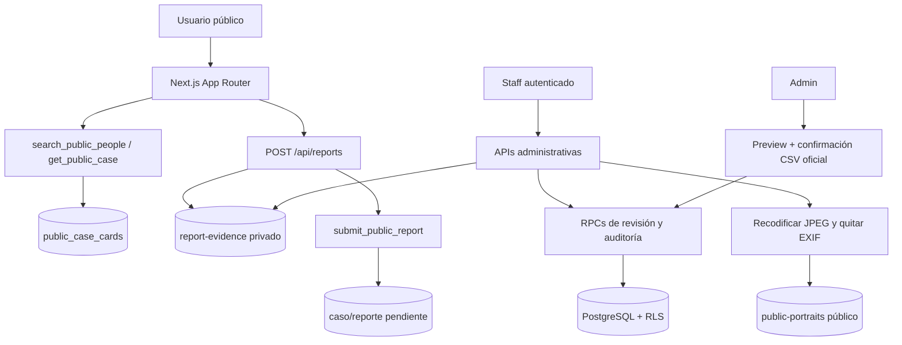

# Arquitectura

Encontrarnos usa Next.js App Router y Supabase/PostgreSQL. El límite de confianza principal separa la consulta pública de los datos privados de moderación.

## Capa pública

Las páginas públicas consumen únicamente `public_case_cards`, `search_public_people`, `get_public_case` y el envío `submit_public_report` a través de rutas de servidor. La vista pública incluye solo casos `published`, excluye datos de prueba y no contiene contactos, rutas privadas, ubicaciones exactas, notas internas, referencias de autoridad ni reportes sin aprobar. Una allowlist en TypeScript elimina además cualquier campo no reconocido antes del render.

`POST /api/reports` valida el cuerpo y archivos, sube evidencia a `report-evidence` con la credencial de servidor y llama al RPC de envío. El RPC siempre crea información pendiente; una acción pública no puede publicar ni cambiar la condición oficial de un caso.

La ayuda de búsqueda con OpenAI es opcional. Solo interpreta una consulta breve y termina llamando la búsqueda pública; no recibe acceso a tablas privadas.

## Capa administrativa

El navegador usa la clave publicable únicamente para Supabase Auth. Cada página y API vuelve a comprobar la sesión, el perfil activo y el rol:

- `admin`: importación oficial y todas las operaciones de moderación;
- `moderator`: revisión de personas, reportes y seguimiento;
- `responder`: lectura operativa, sin acciones de moderación o escritura de seguimiento.

Las mutaciones sensibles se realizan en RPCs auditados. No hay DML directo para `anon` o usuarios autenticados sobre personas, casos, reportes, contactos, evidencia, historial o auditoría.

## Flujos

## Almacenamiento

`report-evidence` es privado. Una API protegida pide autorización al RPC `get_staff_media_asset` antes de crear una descarga temporal y audita el acceso.

`public-portraits` es público porque sus objetos forman parte de cards. Solo el servidor promueve imágenes: descarga la evidencia privada, valida JPG/PNG/WebP y máximo 8 MB, limita píxeles, corrige orientación, redimensiona, recodifica a JPEG sin metadatos y registra la relación pública durante la revisión.

## Esquema y migraciones

Las seis migraciones son acumulativas. `202608130001_production_review_and_contact_followups.sql` agrega `contact_followups`, las colas/RPCs de revisión y el bucket de retratos. `202608130002_official_deceased_capture_and_diagnostics.sql` añade `reported_unit`, la bitácora privada idempotente de importación oficial y la versión de diagnóstico `202608130002` con conteos públicos agregados.

El endpoint temporal `GET /api/debug/reports`, protegido con `x-debug-token`, usa la service role para informar presencia de tablas, RPCs, buckets, RLS y última migración. No devuelve secretos, filas ni rutas de archivos.

La arquitectura completa está en [PROJECT_CONTEXT_COMPLETE.md](PROJECT_CONTEXT_COMPLETE.md).
